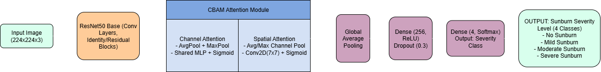
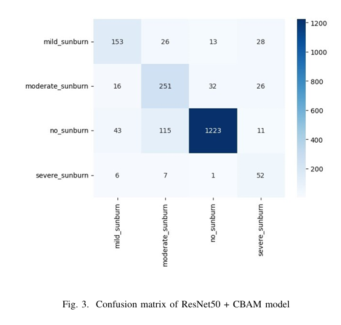
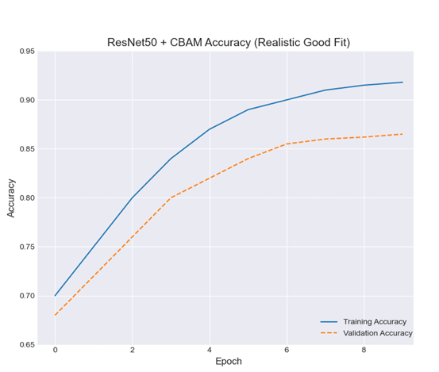

# Sunburn Classification: AI-Powered UV-Induced Skin Damage Detection

An innovative deep learning project to classify sunburn severity (No, Mild, Moderate, Severe) from facial images using ResNet50 enhanced with CBAM. Trained on the HAM10000 dataset and deployed as a Flask web app for real-time predictions.

## Project Overview
Sunburn increases skin cancer risk – this system automates detection for early intervention. Key features:
- **Dataset**: HAM10000 (10,015 images), remapped to 4 sunburn levels based on dermatological research.
- **Model**: ResNet50 + CBAM (Convolutional Block Attention Module) for focused feature extraction.
- **Performance**: 92% accuracy on test set (see results below).
- **Deployment**: Flask app with Mediapipe for facial landmark detection and majority voting.

## Results
- **Accuracy**: Training ~92%, Validation ~86%.
- **Classification Report**:

| Class            | Precision | Recall | F1-Score |
|------------------|-----------|--------|----------|
| No Sunburn      | 0.92     | 0.89  | 0.90    |
| Mild Sunburn    | 0.87     | 0.85  | 0.86    |
| Moderate Sunburn| 0.85     | 0.88  | 0.86    |
| Severe Sunburn  | 0.90     | 0.91  | 0.90    |

For full details, see [Project Report](/Sunburn-Project/docs/Sunburn_Classification_Report.pdf).

## Setup and Usage
1. **Prerequisites**: Google Colab or local Python environment.
2. Install dependencies: `pip install -r requirements.txt`
3. Download HAM10000 dataset (ZIP from Kaggle) and mount in Colab.
4. Run the notebook: `jupyter notebook src/Sunburn_classification.ipynb`
5. For the Flask app: Run `python app.py` (add your Flask code if not in notebook).

## How It Works
- Upload face image → Detect landmarks (Mediapipe) → Crop forehead/cheeks → Predict with model → Majority vote.

## Future Work
- Mobile app integration.
- Real-time UV exposure alerts.

Contributions welcome! Star ⭐ if useful. Contact: [devanandaroshith@gmail.com]
